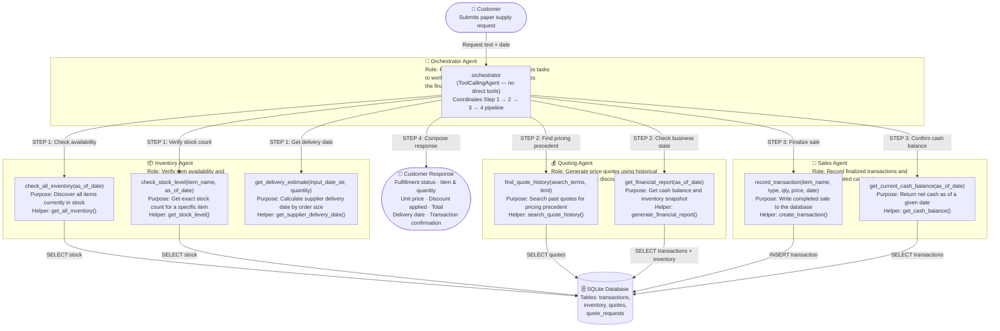

# Beaver's Choice Paper Company — Multi-Agent System Architecture

## Agent Workflow Diagram

---

## Pipeline Sequence

| Step | Agent | Action | Output |
|------|-------|--------|--------|
| 1 | Inventory Agent | Call `check_all_inventory` to discover available items, match to customer request, call `check_stock_level` for exact count, call `get_delivery_estimate` for lead time | Available item name, stock level, estimated delivery date |
| 2 | Quoting Agent | Call `find_quote_history` for pricing precedent, apply bulk discount tier, call `get_financial_report` for business context | Unit price, discount %, total price, quote rationale |
| 3 | Sales Agent | Call `record_transaction` to write sale to DB, call `get_current_cash_balance` to confirm updated balance | Transaction ID, new cash balance |
| 4 | Orchestrator | Compose professional customer-facing response with all details | Final response to customer |

If no matching item is in stock after Step 1, the orchestrator skips Steps 2–3 and goes directly to Step 4 with a polite rejection.

---

## Bulk Discount Tiers (applied in Step 2)

| Order Total | Discount |
|-------------|----------|
| Under $50   | 0%       |
| $50 – $199  | 5%       |
| $200 – $999 | 10%      |
| $1,000+     | 15%      |

---

## Tool-to-Helper Function Mapping

| Tool (Agent-facing) | Helper Function (Starter Code) | Agent |
|---------------------|-------------------------------|-------|
| `check_all_inventory` | `get_all_inventory()` | Inventory Agent |
| `check_stock_level` | `get_stock_level()` | Inventory Agent |
| `get_delivery_estimate` | `get_supplier_delivery_date()` | Inventory Agent |
| `find_quote_history` | `search_quote_history()` | Quoting Agent |
| `get_financial_report` | `generate_financial_report()` | Quoting Agent |
| `record_transaction` | `create_transaction()` | Sales Agent |
| `get_current_cash_balance` | `get_cash_balance()` | Sales Agent |
